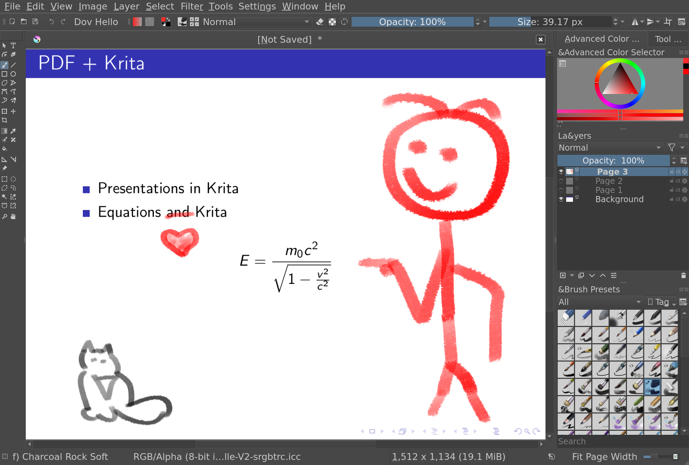

# Introduction

Krisenter is a Krita plugin for viewing a pdf file as a presentation. It is a very hackish way of using Krita in a way that it was not intended for. Still, it offers a way of interacting with pdf presentations in a way that no other tool that I'm aware of does.

# License

Krisenter is licensed under the same license as krita, GPL v3.

# Installation

The installation has currently only been tested on a Linux box. I'll be happy to receive contributions for other platforms.

1. Install the dependent python packages, e.g. with pip.
  * pikeqdf
  * poppler
2. Run the script `install.sh` to install in the users home directory.
3. Run Krita
4. Choose Menu Item Settings→Configure Krita→Python Plugin Manager
5. Activate:
  * Krisenter
  * Next Slide
  * Previous slide
6. Restart Krita

# Running

1. Choose the menu item Tools→Scripts→Krisenter
2. Choose the Input PDF and press OK
3. Navigate the pages with Alt-Right and Alt-Left
4. To save a pdf with overlays Again Tools→Scripts→Krisenter . Krisenter will sense that there is a loaded pdf and offer the option of exporting it to a new pdf.

